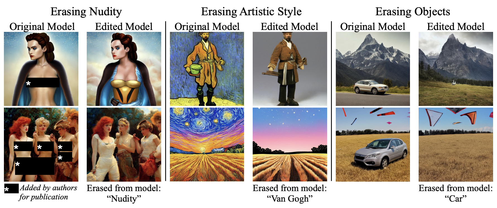
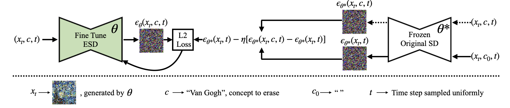

# Erasing Concepts from Diffusion Models
###  [Project Website](https://erasing.baulab.info) | [Arxiv Preprint](https://arxiv.org/pdf/2303.07345.pdf) | [Fine-tuned Weights](https://erasing.baulab.info/weights/esd_models/) | [Demo](https://huggingface.co/spaces/baulab/Erasing-Concepts-In-Diffusion) <br>
 
<div align='center'>

</div>

Motivated by recent advancements in text-to-image diffusion, we study erasure of specific concepts from the model's weights. While Stable Diffusion has shown promise in producing explicit or realistic artwork, it has raised concerns regarding its potential for misuse. We propose a fine-tuning method that can erase a visual concept from a pre-trained diffusion model, given only the name of the style and using negative guidance as a teacher. We benchmark our method against previous approaches that remove sexually explicit content and demonstrate its effectiveness, performing on par with Safe Latent Diffusion and censored training.

To evaluate artistic style removal, we conduct experiments erasing five modern artists from the network and conduct a user study to assess the human perception of the removed styles. Unlike previous methods, our approach can remove concepts from a diffusion model permanently rather than modifying the output at the inference time, so it cannot be circumvented even if a user has access to model weights

Given only a short text description of an undesired visual concept and no additional data, our method fine-tunes model weights to erase the targeted concept. Our method can avoid NSFW content, stop imitation of a specific artist's style, or even erase a whole object class from model output, while preserving the model's behavior and capabilities on other topics.

## Fine-tuned Weights

The finetuned weights for both NSFW and art style erasures are available on our [project page](https://erasing.baulab.info).

## Running Gradio Demo Locally

To run the gradio interactive demo locally, clone the files from [demo repository](https://huggingface.co/spaces/baulab/Erasing-Concepts-In-Diffusion/tree/main) <br>

* Create an environment using the packages included in the requirements.txt file
* Run `python app.py`
* Open the application in browser at `http://127.0.0.1:7860/`
* Train, evaluate, and save models using our method

## Installation Guide

* To get started clone the following repository of Original Stable Diffusion [Link](https://github.com/CompVis/stable-diffusion)
* Then download the files from our repository to `stable-diffusion` main directory of stable diffusion. This would replace the `ldm` folder of the original repo with our custom `ldm` directory
* Download the weights from [here](https://huggingface.co/CompVis/stable-diffusion-v-1-4-original/resolve/main/sd-v1-4-full-ema.ckpt) and move them to `stable-diffusion/models/ldm/` (This will be `ckpt_path` variable in `train-scripts/train-esd.py`)
* [Only for training] To convert your trained models to diffusers download the diffusers Unet config from [here](https://huggingface.co/CompVis/stable-diffusion-v1-4/blob/main/unet/config.json)  (This will be `diffusers_config_path` variable in `train-scripts/train-esd.py`)

## Training Guide

After installation, follow these instructions to train a custom ESD model:

* `cd stable-diffusion` to the main repository of stable-diffusion
* [IMPORTANT] Edit `train-script/train-esd.py` and change the default argparser values according to your convenience (especially the config paths)
* To choose train_method, pick from following `'xattn'`,`'noxattn'`, `'selfattn'`, `'full'` 
* `python train-scripts/train-esd.py --prompt 'your prompt' --train_method 'your choice of training' --devices '0,1'`

Note that the default argparser values must be changed!

The optimization process for erasing undesired visual concepts from pre-trained diffusion model weights involves using a short text description of the concept as guidance. The ESD model is fine-tuned with the conditioned and unconditioned scores obtained from frozen SD model to guide the output away from the concept being erased. The model learns from it's own knowledge to steer the diffusion process away from the undesired concept.
<div align='center'>

</div>

## Generating Images

To generate images from one of the custom models use the following instructions:

* To use `eval-scripts/generate-images.py` you would need a csv file with columns `prompt`, `evaluation_seed` and `case_number`. (Sample data in `data/`)
* To generate multiple images per prompt use the argument `num_samples`. It is default to 10.
* The path to model can be customised in the script.
* It is to be noted that the current version requires the model to be in saved in `stable-diffusion/compvis-<based on hyperparameters>/diffusers-<based on hyperparameters>.pt`
* `python eval-scripts/generate-images.py --model_name='compvis-word_VanGogh-method_xattn-sg_3-ng_1-iter_1000-lr_1e-05' --prompts_path 'stable-diffusion/art_prompts.csv' --save_path 'evaluation_folder' --num_samples 10` 

### UPDATE (NudeNet)
If you want to recreate the results from our paper on NSFW task - please use this https://drive.google.com/file/d/1J_O-yZMabmS9gBA2qsFSrmFoCl7tbFgK/view?usp=sharing

* Untar this file and save it in the homedirectory '~/.NudeNet'
* This should enable the right results as we use this checkpoint for our analysis.
  
## Citing our work
The preprint can be cited as follows
```
@inproceedings{gandikota2023erasing,
  title={Erasing Concepts from Diffusion Models},
  author={Rohit Gandikota and Joanna Materzy\'nska and Jaden Fiotto-Kaufman and David Bau},
  booktitle={Proceedings of the 2023 IEEE International Conference on Computer Vision},
  year={2023}
}
```
